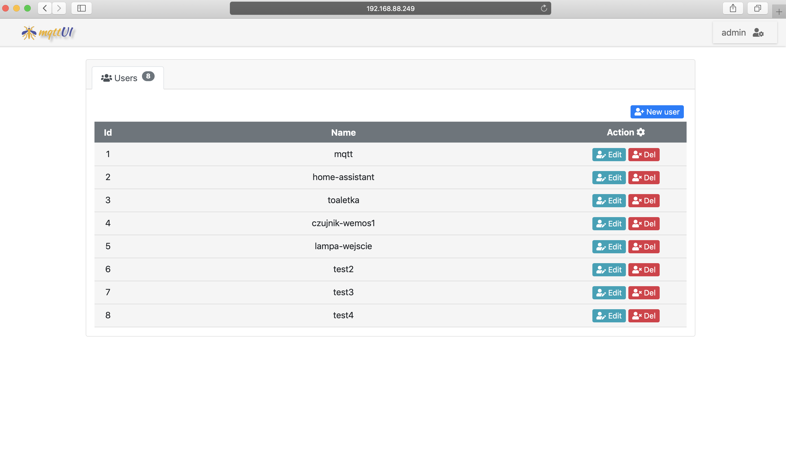

# Manage some features Mosquitto by UI

__NOTE! This project is experimental simply application as part of python learning.__

Current features is:
- manage the password file

### Current view UI page

## License 
The code in this repository, unless otherwise noted, is MIT licensed. See the LICENSE file for more.
